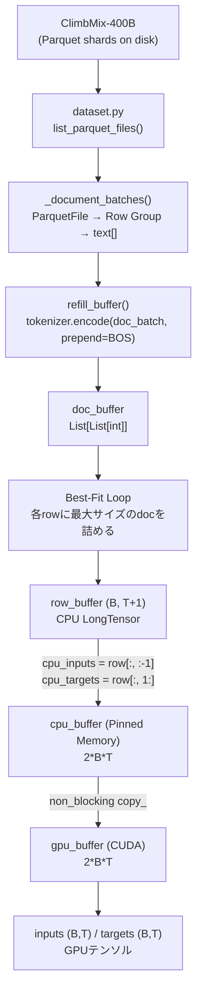

# nanochat アーキテクチャ概要

## 1. 主要フォルダの役割

### `nanochat/` — コアライブラリ

| ファイル | 役割 |
|---|---|
| `gpt.py` | GPTモデル本体。RoPE・GQA・Flash Attention 3・Value Embedding等を実装 |
| `tokenizer.py` | BPEトークナイザー。`HuggingFaceTokenizer`と`RustBPETokenizer`の2実装。会話フォーマットのレンダリングも担当 |
| `dataloader.py` | 分散対応データローダー。BOS-aligned Best-Fit Packingアルゴリズムで100%トークン利用率を実現 |
| `dataset.py` | ClimbMix-400B（Parquetファイル群）のダウンロード・管理・イテレーション |
| `common.py` | 共通ユーティリティ。DDP初期化、デバイス検出、`COMPUTE_DTYPE`自動判定、GPU FLOPSテーブル等 |
| `optim.py` | Muon + AdamW ハイブリッドオプティマイザー実装 |
| `fp8.py` | FP8学習のための`Float8Linear`実装（H100以上向け） |
| `flash_attention.py` | Flash Attention 3ラッパー（Hopper GPU検出、SDPA fallback） |
| `engine.py` | KVキャッシュを使った推論エンジン |
| `checkpoint_manager.py` | チェックポイントの保存・ロード管理 |
| `core_eval.py` / `loss_eval.py` | CORE指標・BPB（Bits Per Byte）評価ロジック |
| `report.py` | 実験レポートのロギング |
| `ui.html` | Webチャット用フロントエンドHTML |

### `scripts/` — 実行スクリプト（エントリーポイント）

| ファイル | 役割 |
|---|---|
| `base_train.py` | **事前学習**メインスクリプト。モデル構築→データローダー初期化→学習ループ→評価→チェックポイント保存 |
| `base_eval.py` | 事前学習モデルのCORE指標評価（ARC, MMLU等22タスクのアンサンブル） |
| `chat_sft.py` | **SFT（教師あり微調整）**スクリプト |
| `chat_rl.py` | **強化学習（GRPO）**スクリプト |
| `chat_eval.py` | チャットモデルのChatCORE評価 |
| `chat_web.py` | Webチャットインターフェースのサーバー起動 |
| `chat_cli.py` | CLIチャットインターフェース |
| `tok_train.py` | BPEトークナイザーの学習（ClimbMixデータから32768語彙を学習） |
| `tok_eval.py` | トークナイザーの評価 |

### `tasks/` — 評価タスクライブラリ

| ファイル | 役割 |
|---|---|
| `common.py` | 基底クラス `Task`、`TaskMixture`、`TaskSequence` を定義 |
| `arc.py` | ARC-Easy / ARC-Challenge（常識推論）タスク |
| `mmlu.py` | MMLU（57分野の多肢選択）タスク |
| `gsm8k.py` | GSM8K（小学校算数）タスク |
| `humaneval.py` | HumanEval（コード生成）タスク |
| `smoltalk.py` | SmolTalk（SFT用会話データ）タスク |
| `spellingbee.py` | スペリングビー（文字操作）タスク |
| `customjson.py` | カスタムJSONフォーマットのタスク読み込み |

---

## 2. トークナイザー & データローダーの処理フロー

### 全体フロー図（Mermaid）



### ステップ1: トークナイザーの学習 (`scripts/tok_train.py`)

1. `parquets_iter_batched("train")` でClimbMixデータを逐次読み込み
2. 各ドキュメントを最大10,000文字にキャップ、合計20億文字で打ち切り
3. `RustBPETokenizer.train_from_iterator()` でBPE学習
   - `rustbpe` ライブラリで語彙32,768（特殊トークン9個を除く32,759）を学習
   - GPT-4スタイルの正規表現パターンを使用
   - 学習後、`tiktoken.Encoding` に変換して高速推論に対応
4. `tokenizer.pkl` として保存

### ステップ2: 特殊トークンの定義 (`nanochat/tokenizer.py`)

```
<|bos|>              ← 全ドキュメントの先頭（事前学習・SFT共通）
<|user_start|>       ← ユーザー発話の開始（SFT以降）
<|user_end|>         ← ユーザー発話の終了
<|assistant_start|>  ← アシスタント発話の開始
<|assistant_end|>    ← アシスタント発話の終了
<|python_start/end|> ← Pythonツール呼び出し
<|output_start/end|> ← Python実行結果
```

### ステップ3: データローダーの動作 (`nanochat/dataloader.py`)

#### 3-1. `_document_batches()` — Parquetファイルの無限イテレーター

- DDP環境では `rg_idx = ddp_rank` から開始し、`rg_idx += ddp_world_size` でランクごとに異なるRow Groupを処理
- チェックポイントからの再開時は `resume_rg_idx` を計算して重複を回避
- 全ファイルを消費したら `epoch` をインクリメントして無限ループ

#### 3-2. `refill_buffer()` — トークン化してバッファに追加

```python
doc_batch, (pq_idx, rg_idx, epoch) = next(batches)
token_lists = tokenizer.encode(doc_batch, prepend=bos_token, num_threads=4)
for tokens in token_lists:
    doc_buffer.append(tokens)
```

- `tokenizer.encode()` はマルチスレッド（`num_threads=4`）でバッチ処理
- 各ドキュメントの先頭に `<|bos|>` を付加

#### 3-3. Best-Fit Packingアルゴリズム

各バッチ行（row）を埋めるループ：

```
pos = 0
while pos < T+1:
    ① doc_bufferが1000件未満なら refill_buffer()
    ② remaining = (T+1) - pos
    ③ doc_bufferの中で「remaining以下かつ最大長」のdocを探す
       → 見つかれば: そのdocをrow_bufferに書き込み、pos += doc_len
       → 見つからなければ: 最短docをremainingにクロップして書き込み、pos = T+1
```

パディングゼロ・100%トークン利用率。ただしT=2048では約35%のトークンがクロップで破棄される。

#### 3-4. メモリレイアウトと転送

| バッファ | 型 | サイズ | 場所 |
|---|---|---|---|
| `doc_buffer` | `List[List[int]]` | 最大1000件 | CPU (Python) |
| `row_buffer` | `LongTensor` | `(B, T+1)` | CPU |
| `cpu_buffer` | `LongTensor` (Pinned) | `2*B*T` | CPU Pinned |
| `gpu_buffer` | `LongTensor` | `2*B*T` | GPU |

- `cpu_inputs = cpu_buffer[:B*T]`、`cpu_targets = cpu_buffer[B*T:]` はビュー（コピーなし）
- `gpu_buffer.copy_(cpu_buffer, non_blocking=True)` で1回のHtoD転送のみ
- `inputs = row_buffer[:, :-1]`、`targets = row_buffer[:, 1:]`（1トークンずれた言語モデリング）

---

*Generated by Devin on 2026-06-17*
