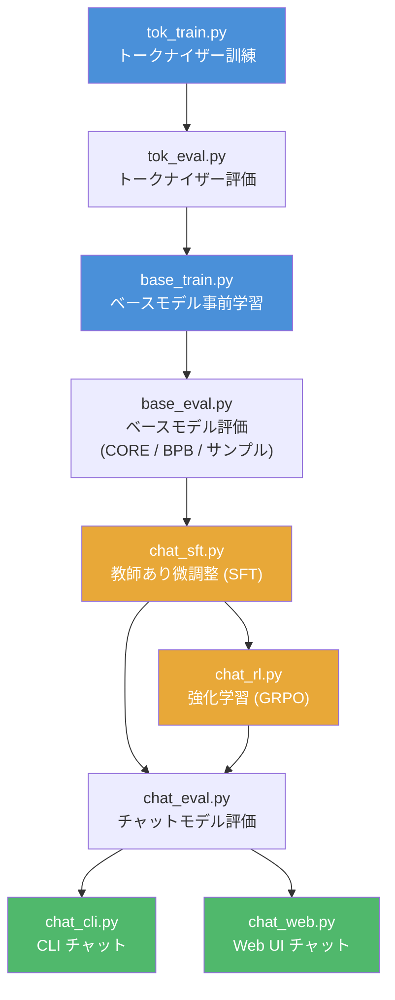

# 主要フォルダの役割まとめ

本ドキュメントでは、nanochat リポジトリの主要フォルダ（`nanochat/`、`scripts/`、`tasks/`）に含まれる各ファイルの役割を説明します。

---

## `nanochat/` — コアライブラリ

モデル定義、推論エンジン、データローダーなど、nanochat の中核となるモジュール群です。

| ファイル | 役割 |
|---------|------|
| `gpt.py` | GPT Transformer モデル（`nn.Module`）の定義。Rotary Embeddings、QK Norm、ReLU² MLP、GQA（Group-Query Attention）、Flash Attention 3 統合などの特徴を含む |
| `tokenizer.py` | GPT-4 スタイルの BPE トークナイザーラッパー。`HuggingFaceTokenizer`（訓練・推論両用）と `RustBPETokenizer`（rustbpe で訓練、tiktoken で高速推論）の 2 実装を提供。会話のトークン化（`render_conversation`）も担当 |
| `dataloader.py` | 分散データローダー。Parquet ファイルからドキュメントを読み込み、トークナイズし、BOS アラインのベストフィットパッキングで 100% トークン利用率を実現 |
| `dataset.py` | 事前学習用データセット（Parquet ファイル）のダウンロード・読み込みユーティリティ。HuggingFace 上の ClimbMix データセットをオンデマンドで取得 |
| `optim.py` | AdamW + Muon 複合オプティマイザー。エンベディングとスカラーは AdamW、行列パラメータは Muon（直交オプティマイザー）で最適化。単一 GPU 版（`MuonAdamW`）と分散版（`DistMuonAdamW`）を提供 |
| `engine.py` | KV キャッシュを使用した効率的なモデル推論エンジン。トークン列を受け取り次のトークンを返す。トークナイゼーションには関与しない |
| `common.py` | 共通ユーティリティ。`COMPUTE_DTYPE` の自動検出、ロギング設定、ファイルダウンロード、分散情報取得（`get_dist_info`）など |
| `checkpoint_manager.py` | モデル・オプティマイザー・状態のチェックポイント保存・読み込みユーティリティ |
| `core_eval.py` | DCLM 論文に基づく CORE メトリック（ICL タスクの精度）の評価関数 |
| `loss_eval.py` | ベースモデルの Bits Per Byte（BPB）評価。語彙サイズに依存しない損失指標を計算 |
| `fp8.py` | 最小限の FP8 訓練実装。torchao の Float8Linear のドロップイン代替（約 150 行）。テンソル単位の動的スケーリングで cuBLAS FP8 カーネルを活用し、bf16 比で約 2 倍の高速化を実現 |
| `flash_attention.py` | Flash Attention の統一インターフェース。Hopper+ GPU では FA3 を使用し、それ以外（Blackwell 含む）では PyTorch SDPA にフォールバック |
| `execution.py` | LLM が生成した Python コードのサンドボックス実行。プロセス分離、タイムアウト、メモリ制限（256MB）を備えたコード実行環境 |
| `report.py` | 訓練レポートカード生成ユーティリティ。システム情報やトレーニング結果の収集・出力 |
| `ui.html` | nanochat フロントエンドの HTML/CSS/JavaScript。ChatGPT 風の Web チャット UI |

---

## `scripts/` — 実行エントリーポイント

事前学習、ファインチューニング、評価、推論のための実行スクリプト群です。

| スクリプト | 役割 |
|-----------|------|
| `tok_train.py` | トークナイザーの訓練。GPT-4 スタイルの BPE トークナイザーを rustbpe で学習 |
| `tok_eval.py` | トークナイザーの圧縮率評価 |
| `base_train.py` | ベースモデルの事前学習。`torchrun` による分散訓練をサポート |
| `base_eval.py` | ベースモデルの統合評価。CORE メトリック、BPB、サンプル生成の 3 モードに対応 |
| `chat_sft.py` | チャットモデルの教師あり微調整（SFT） |
| `chat_rl.py` | チャットモデルの強化学習（簡略化 GRPO / REINFORCE）。GSM8K 等のタスクで報酬ベースの学習を実行 |
| `chat_eval.py` | チャットモデルの評価。タスク固有の評価コードを呼び出す |
| `chat_cli.py` | チャットモデルとの CLI 対話インターフェース。単一 GPU で実行 |
| `chat_web.py` | チャットモデルの Web UI サーバー。FastAPI ベースで、データ並列による複数 GPU 分散推論をサポート |

### 訓練パイプラインの流れ

以下のフローチャートは、トークナイザー訓練からチャットモデルの展開までのパイプライン全体を示しています。



---

## `tasks/` — タスクデータセット

SFT・RL・評価で使用されるタスク（データセット + 評価基準）の実装群です。

| ファイル | 役割 |
|---------|------|
| `common.py` | `Task` 基底クラス、`TaskMixture`（複数タスクの混合）、`TaskSequence`（タスクの順次実行）の定義。多肢選択の共通レンダリング関数（`render_mc`）も含む |
| `arc.py` | ARC（AI2 Reasoning Challenge）— Allen AI の多肢選択科学問題データセット |
| `mmlu.py` | MMLU（Massive Multitask Language Understanding）— 幅広いトピックの多肢選択問題 |
| `gsm8k.py` | GSM8K — 8,000 問の小学校レベルの算数問題。Python コード実行による解答評価をサポート |
| `humaneval.py` | HumanEval — シンプルな Python コーディングタスク（名前に反して人間の評価ではない）。`execution.py` のサンドボックスでコード実行・検証 |
| `smoltalk.py` | SmolTalk — HuggingFace の汎用会話データセット（"smol" バージョン）。小規模モデルに適したサイズ |
| `spellingbee.py` | SpellingBee — スペルと文字カウントの能力を訓練するタスク（例:「strawberry に r は何個？」）。手動カウントと Python ツール呼び出しの併用を学習 |
| `customjson.py` | CustomJSON — 任意の JSONL ファイルから会話を読み込んでタスクを作成。カスタムデータセットの統合に使用 |

### `Task` 基底クラスの構造

すべてのタスクは `tasks/common.py` で定義される `Task` 基底クラスを継承します。

```
Task
├── __init__(start, stop, step)   # データセットの軽量スライシング
├── eval_type (property)          # 'generative' | 'categorical'
├── num_examples()                # データセット中の総サンプル数
├── get_example(index)            # 物理インデックスでサンプルを取得
├── __len__()                     # スライス後の論理的な長さ
├── __getitem__(index)            # 論理インデックス → 物理インデックスへの変換
└── evaluate(problem, completion) # モデル出力の評価
```

- **`TaskMixture`**: 複数の `Task` を混合し、決定論的シャッフルで訓練データ全体に均等に分散。同じタスクを複数回渡すことでオーバーサンプリングが可能
- **`TaskSequence`**: 複数の `Task` を順次連結。カリキュラム学習に有用

各タスクは**会話形式**（`{"messages": [...]}`）でサンプルを返し、トークナイザーの `render_conversation()` でトークン列に変換されます。
