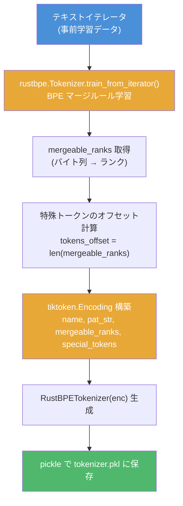
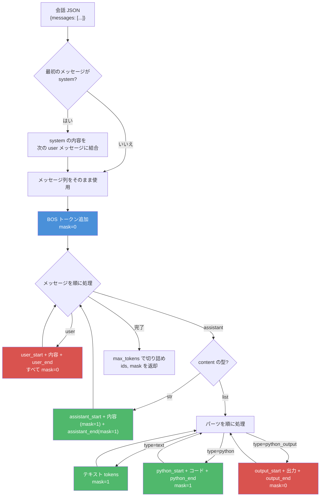
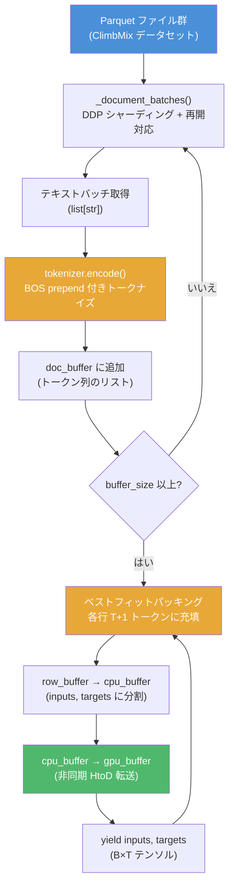
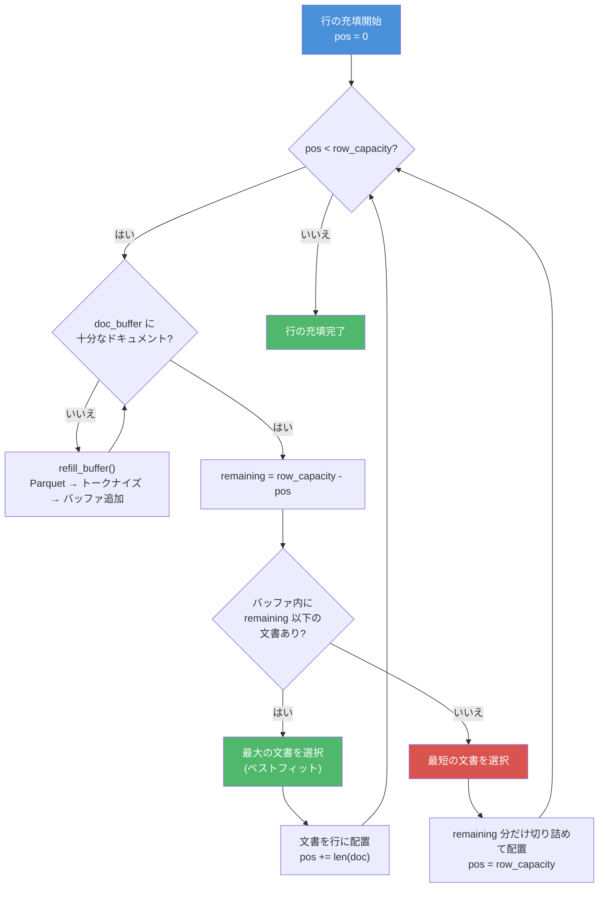
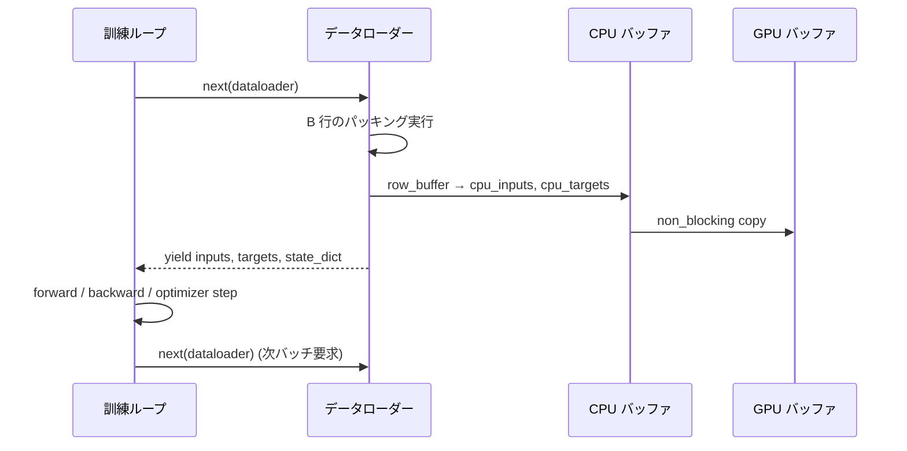

# トークナイザー & データローダーの処理フロー

本ドキュメントでは、nanochat のトークナイザー（`nanochat/tokenizer.py`）とデータローダー（`nanochat/dataloader.py`）の内部処理フローを詳細に説明します。

---

## 1. トークナイザー（`nanochat/tokenizer.py`）

### 1.1 HuggingFaceTokenizer vs RustBPETokenizer

nanochat には 2 つのトークナイザー実装があります。

| | HuggingFaceTokenizer | RustBPETokenizer |
|---|---|---|
| **訓練ライブラリ** | HuggingFace `tokenizers` | `rustbpe`（Rust 製 BPE） |
| **推論ライブラリ** | HuggingFace `tokenizers` | `tiktoken`（OpenAI 製、高速） |
| **保存形式** | `tokenizer.json` | `tokenizer.pkl`（pickle 化した `tiktoken.Encoding`） |
| **バッチエンコード** | 逐次処理 | `encode_ordinary_batch` による並列処理（`num_threads` 指定可） |
| **用途** | 汎用（GPT-2 等の既存トークナイザー読み込み対応） | nanochat のデフォルト実装。高速な訓練・推論を実現 |

どちらの実装も同じ GPT-4 スタイルの split パターン（正規表現）を共有し、`byte_fallback` を有効にした BPE を使用します。デフォルトでは `RustBPETokenizer` が使用されます（`get_tokenizer()` 関数）。

### 1.2 トークナイザー訓練フロー

`scripts/tok_train.py` によるトークナイザー訓練の流れを示します。



**ポイント:**
- rustbpe で BPE マージルールを学習し、その結果を `tiktoken.Encoding` に変換することで、訓練は Rust の高速性を、推論は tiktoken の効率性を活かしています
- 特殊トークンは BPE 訓練には含めず、通常の語彙の後にオフセットを付けて追加されます
- `vocab_size_no_special = vocab_size - len(SPECIAL_TOKENS)` で BPE 語彙と特殊トークンの合計が指定サイズになるよう調整

### 1.3 特殊トークン（9 種）

nanochat では以下の 9 つの特殊トークンを使用します。

| トークン | 用途 |
|---------|------|
| `<\|bos\|>` | **文書の先頭**（Beginning of Sequence）。すべての文書・会話の冒頭に付与 |
| `<\|user_start\|>` | ユーザーメッセージの開始 |
| `<\|user_end\|>` | ユーザーメッセージの終了 |
| `<\|assistant_start\|>` | アシスタントメッセージの開始 |
| `<\|assistant_end\|>` | アシスタントメッセージの終了 |
| `<\|python_start\|>` | Python ツール呼び出しの開始 |
| `<\|python_end\|>` | Python ツール呼び出しの終了 |
| `<\|output_start\|>` | Python 実行結果の開始 |
| `<\|output_end\|>` | Python 実行結果の終了 |

最初のトークン `<|bos|>` は事前学習で文書の区切りとして使用されます。残りの 8 トークンはファインチューニング時の会話レンダリングで使用されます。

### 1.4 `encode()` メソッドの動作

`encode()` は単一文字列またはバッチ（文字列リスト）の両方を受け付けます。

```
encode(text, prepend=None, append=None, num_threads=8)
```

| 引数 | 説明 |
|------|------|
| `text` | `str`（単一文字列）または `list[str]`（バッチ） |
| `prepend` | エンコード結果の先頭に追加するトークン。特殊トークン名（`str`）またはトークン ID（`int`）を指定可 |
| `append` | エンコード結果の末尾に追加するトークン。同上 |
| `num_threads` | バッチエンコード時の並列スレッド数（`RustBPETokenizer` のみ有効、デフォルト 8） |

**動作の違い:**
- **単一文字列** (`str`): `encode_ordinary()` で通常トークンのみをエンコードし、`prepend`/`append` を前後に付加
- **バッチ** (`list[str]`): `encode_ordinary_batch()` でマルチスレッド並列エンコードし、各行に `prepend`/`append` を付加

### 1.5 `render_conversation()` の動作

`render_conversation()` は会話（`{"messages": [...]}`）をトークン列とマスクに変換します。SFT 訓練で使用され、アシスタントが予測すべきトークンのみに `mask=1` を設定します。



**マスクの割り当てルール:**

| 部分 | mask 値 | 理由 |
|------|---------|------|
| BOS | 0 | 区切りトークン、予測対象外 |
| ユーザーメッセージ全体 | 0 | 入力コンテキスト（予測対象外） |
| `<\|assistant_start\|>` | 0 | 構造トークン |
| アシスタントのテキスト | **1** | **モデルが予測を学習すべき対象** |
| アシスタントの Python コード | **1** | ツール使用を学習 |
| Python 実行出力 | 0 | テスト時は Python REPL から供給されるため、予測対象外 |
| `<\|assistant_end\|>` | **1** | 会話の終了を学習 |

---

## 2. データローダー（`nanochat/dataloader.py`）

### 2.1 全体フロー

事前学習データローダーの処理フロー全体を示します。



### 2.2 `_document_batches()` の動作

`_document_batches()` は Parquet ファイルからテキストドキュメントを無限にイテレートするジェネレータです。

**主な機能:**

- **DDP シャーディング**: 各 DDP ランクは row group 単位でインターリーブ（`rg_idx = ddp_rank`、`rg_idx += ddp_world_size`）。各ランクが異なるデータを処理
- **データ分割**: 全 Parquet ファイルのうち最後の 1 ファイルが `val`（検証）、残りが `train`（訓練）
- **再開対応**: `resume_state_dict` に `pq_idx`（Parquet ファイルインデックス）、`rg_idx`（row group インデックス）、`epoch` を記録し、チェックポイントから再開可能。再開時はデータ繰り返しを避けるため 1 ステップ進める
- **マルチエポック**: すべてのファイルを読み終えると `epoch` をインクリメントして先頭に戻る（無限ループ）
- **バッチ出力**: `tokenizer_batch_size`（デフォルト 128）ごとにテキストリストを yield

### 2.3 BOS アライン + ベストフィットパッキングアルゴリズム

データローダーの核心は、トークンの 100% 利用率を達成する「BOS アラインのベストフィットパッキング」アルゴリズムです。

**設計原則:**
- すべての行は BOS トークンで始まる（各ドキュメントに `prepend=bos_token` でエンコード済み）
- パディングなし — 100% のトークンが訓練に使用される
- 約 35% のトークンがクロッピングにより破棄される（T=2048 の場合）

**アルゴリズム（各行 `row_capacity = T + 1` トークンを充填）:**

```
各行について:
    pos = 0
    while pos < row_capacity:
        1. doc_buffer を buffer_size 以上に補充
        2. バッファ内で remaining (= row_capacity - pos) 以下の
           最大の文書を探す (ベストフィット)
        3. 見つかった場合:
           → その文書をバッファから取り出し、行に配置
           → pos += len(doc)
        4. 見つからない場合 (どの文書も収まらない):
           → バッファ内の最短の文書を取り出す
           → remaining トークン分だけ切り詰めて行を埋める
           → pos = row_capacity (行の充填完了)
```



**なぜベストフィットか？**
- 単純な先頭から順に詰める方式（greedy）よりもクロッピングで廃棄されるトークンが少ない
- バッファ内の文書サイズの多様性を活かし、残りスペースに最も適合する文書を選択
- 「収まらない場合は最短を切り詰め」により、大きな文書の無駄な廃棄を最小化

### 2.4 メモリ効率化

データローダーは以下の手法でメモリ効率と転送速度を最適化しています。

| 手法 | 説明 |
|------|------|
| **事前確保バッファ** | `row_buffer`（行組み立て用）、`cpu_buffer`（ステージング）、`gpu_buffer`（デバイス上）を起動時に 1 回だけ確保。毎バッチのメモリ割り当てを回避 |
| **ピン留め CPU バッファ** | `cpu_buffer` は `pin_memory=True` で確保（CUDA 使用時）。ピン留めメモリにより DMA 転送が高速化 |
| **連続メモリレイアウト** | `inputs` と `targets` を単一の連続バッファ `[inputs(B*T) \| targets(B*T)]` に配置。1 回の HtoD 転送で両方を転送 |
| **非同期 HtoD 転送** | `gpu_buffer.copy_(cpu_buffer, non_blocking=True)` により、CPU→GPU 転送を非同期実行。転送中に CPU 側の次バッチ準備と並行可能 |

### 2.5 訓練ループとの連携（プリフェッチ）

データローダーは Python ジェネレータ（`yield`）として実装されています。訓練ループとの連携フローは以下の通りです:



- データローダーは無限ジェネレータであり、`next()` を呼び出すたびに次のバッチを生成
- `state_dict`（`pq_idx`, `rg_idx`, `epoch`）が各 yield で返され、チェックポイントに保存することで中断・再開が可能
- `tokenizing_distributed_data_loader_bos_bestfit()` はステート情報を省略したラッパーで、`state_dict` が不要な場合に使用
