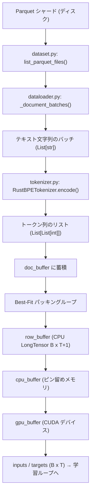
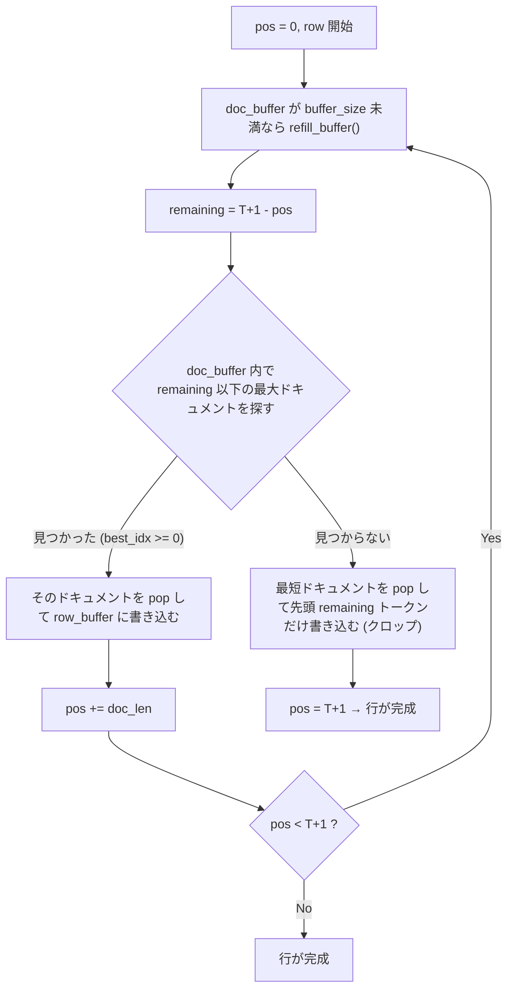

# nanochat トークナイザー & データローダー 実装解説

---

## 全体の処理フロー



---

## 1. トークナイザー (`nanochat/tokenizer.py`)

### 1.1 実装の概要

2つの実装が共存している。

| クラス | 用途 | バックエンド |
|---|---|---|
| `HuggingFaceTokenizer` | 学習・推論両用 (参照実装) | HuggingFace `tokenizers` |
| `RustBPETokenizer` | **本番使用** | 学習: `rustbpe` / 推論: `tiktoken` |

実際に使われるのは `RustBPETokenizer` のみ。`get_tokenizer()` がこれを返す。

---

### 1.2 特殊トークン

9種類の特殊トークンが定義されている。

```
<|bos|>              ← 全ドキュメントの先頭に付与 (事前学習・SFT共通)
<|user_start|>       ← ユーザー発話の開始 (SFT/RL のみ)
<|user_end|>         ← ユーザー発話の終了
<|assistant_start|>  ← アシスタント発話の開始
<|assistant_end|>    ← アシスタント発話の終了
<|python_start|>     ← Python REPL ツール呼び出し
<|python_end|>
<|output_start|>     ← Python REPL の出力
<|output_end|>
```

---

### 1.3 分割パターン (SPLIT_PATTERN)

GPT-4 スタイルの正規表現でテキストを BPE 前に分割する。GPT-4 との差異は数字の最大連続長を `{1,3}` → `{1,2}` に変更している点。語彙サイズ 32K では 2 が最適と検証済み。

---

### 1.4 トークナイザーの学習フロー (`scripts/tok_train.py`)


**`train_from_iterator` の内部処理:**

1. `rustbpe.Tokenizer` で BPE マージ規則を学習 (特殊トークンは除外した `vocab_size - 9` で学習)
2. 学習済みの `mergeable_ranks` (バイト列 → マージ優先度) を取得
3. 特殊トークンを末尾に追加して `tiktoken.Encoding` を構築
4. 推論時は tiktoken の高速エンジンを使用

---

### 1.5 `encode()` メソッドの動作

```python
tokenizer.encode(text, prepend="<|bos|>", num_threads=8)
```

- 文字列 1 件 → `enc.encode_ordinary(text)` (tiktoken)
- リスト → `enc.encode_ordinary_batch(text, num_threads=num_threads)` で並列処理
- `prepend` / `append` で特殊トークンを前後に挿入

---

### 1.6 会話のトークン化 (`render_conversation`)

SFT/RL 用。会話を以下の構造でトークン化し、`(ids, mask)` を返す。

```
<|bos|>
<|user_start|> ユーザーテキスト <|user_end|>
<|assistant_start|> アシスタントテキスト <|assistant_end|>
...
```

`mask=1` はアシスタントが生成したトークン (損失計算対象)、`mask=0` はユーザー/システムトークン (損失計算対象外)。

---

## 2. データローダー (`nanochat/dataloader.py`)

### 2.1 メイン関数のシグネチャ

```python
tokenizing_distributed_data_loader_with_state_bos_bestfit(
    tokenizer, B, T, split,
    tokenizer_threads=4, tokenizer_batch_size=128,
    device="cuda", resume_state_dict=None,
    buffer_size=1000
)
```

無限ジェネレータで `(inputs, targets, state_dict)` を yield し続ける。

---

### 2.2 メモリバッファの構造

事前に4種類のバッファを確保し、コピー回数を最小化する。

```
doc_buffer   List[List[int]]  トークン化済みドキュメントの待機列 (Python)
row_buffer   (B, T+1) long    行を組み立てる作業領域 (CPU)
cpu_buffer   (2*B*T,) long    ピン留めメモリのステージング領域 (CPU)
gpu_buffer   (2*B*T,) long    最終的な学習バッチ (GPU)
```

`cpu_buffer` の前半 `B*T` が inputs、後半 `B*T` が targets のビューになっている。

---

### 2.3 BOS-Aligned Best-Fit パッキングアルゴリズム

各行 (長さ `T+1`) を埋めるループの詳細:



**設計上のトレードオフ:**
- パディングは **ゼロ** (100% 利用率)
- T=2048 では約 **35%** のトークンがクロップにより破棄される
- 代わりに全トークンが BOS トークンまで遡れる = 文脈が常に明確

---

### 2.4 `refill_buffer()` の動作

```python
def refill_buffer():
    doc_batch, (pq_idx, rg_idx, epoch) = next(batches)
    token_lists = tokenizer.encode(doc_batch, prepend=bos_token, num_threads=tokenizer_threads)
    for tokens in token_lists:
        doc_buffer.append(tokens)
```

- `_document_batches` から次のテキストバッチを取得
- `tokenizer.encode` でバッチ並列トークン化 (BOS を先頭に付与)
- 結果を `doc_buffer` に追加

---

### 2.5 HtoD 転送とバッチの yield

```python
cpu_inputs.copy_(row_buffer[:, :-1])   # inputs  = トークン[0..T-1]
cpu_targets.copy_(row_buffer[:, 1:])   # targets = トークン[1..T]  (1つずれ)

gpu_buffer.copy_(cpu_buffer, non_blocking=True)  # 単一の非同期 HtoD コピー
yield inputs, targets, state_dict
```

`row_buffer` の `T+1` 列を 1 ずらしてスライスすることで、追加メモリなしに inputs/targets を生成。

---

### 2.6 DDP シャーディングとチェックポイント再開

**シャーディング:** Row Group 単位で各ランクに割り当て。

```
rank 0: rg_idx = 0, world_size, 2*world_size, ...
rank 1: rg_idx = 1, world_size+1, ...
```

**再開:** `state_dict = {pq_idx, rg_idx, epoch}` を毎バッチ yield し、チェックポイントに保存。再開時は `resume_rg_idx // world_size + 1` で次の未処理 Row Group を計算してスキップ。

---

## 3. まとめ: 設計上の重要な判断

| 判断 | 内容 | 根拠 |
|---|---|---|
| rustbpe + tiktoken の分離 | 学習は rustbpe、推論は tiktoken | tiktoken の推論速度を活かしつつ独自 BPE を使用 |
| 数字分割を `{1,2}` に変更 | GPT-4 の `{1,3}` から変更 | 32K 語彙では 2 が最適と実験で確認 |
| BOS-Aligned パッキング | 全行を BOS で開始 | 文脈の混在を防ぎ、学習品質を向上 |
| Best-Fit (最大適合) | 最も大きく収まるドキュメントを選択 | Greedy より無駄なクロップを削減 |
| ピン留めメモリ + 単一 HtoD | `cpu_buffer` → `gpu_buffer` を 1 回で転送 | PCIe 帯域の効率的な利用 |
| Row Group 単位のシャーディング | ファイル単位ではなく Row Group 単位 | 細粒度な DDP 分散と正確な再開を両立 |
